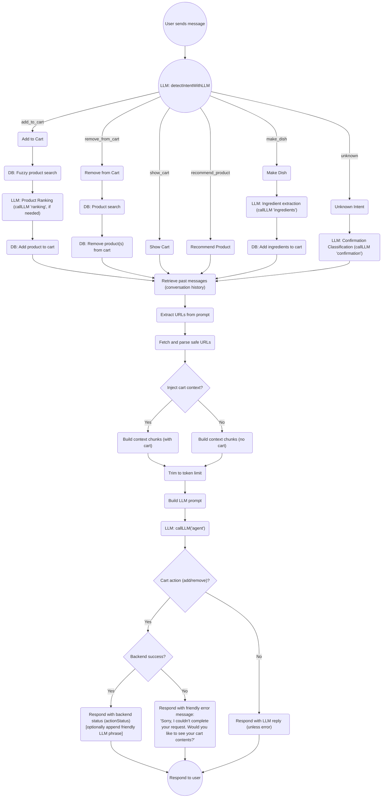

```mermaid
flowchart TD
    %% User and Intent Detection
    A(("User sends message")) --> B(("LLM: detectIntentWithLLM"))
    B -->|add_to_cart| C1("Add to Cart")
    B -->|remove_from_cart| C2("Remove from Cart")
    B -->|show_cart| C3("Show Cart")
    B -->|recommend_product| C4("Recommend Product")
    B -->|make_dish| C5("Make Dish")
    B -->|unknown| C6("Unknown Intent")

    %% Add to Cart branch
    C1 --> D1("DB: Fuzzy product search")
    D1 --> E1("LLM: Product Ranking (callLLM 'ranking', if needed)")
    E1 --> F1("DB: Add product to cart")
    F1 --> RAGa

    %% Remove from Cart branch
    C2 --> D2("DB: Product search")
    D2 --> E2("DB: Remove product(s) from cart")
    E2 --> RAGa

    %% Show Cart branch
    C3 --> RAGa

    %% Recommend Product branch
    C4 --> RAGa

    %% Make Dish branch
    C5 --> D5("LLM: Ingredient extraction (callLLM 'ingredients')")
    D5 --> E5("DB: Add ingredients to cart")
    E5 --> RAGa

    %% Unknown branch
    C6 --> D6("LLM: Confirmation Classification (callLLM 'confirmation')")
    D6 --> RAGa

    %% RAG Pipeline steps
    RAGa("Retrieve past messages (conversation history)") --> RAGb("Extract URLs from prompt")
    RAGb --> RAGc("Fetch and parse safe URLs")
    RAGc --> RAGd{"Inject cart context?"}
    RAGd -- Yes --> RAGe("Build context chunks (with cart)")
    RAGd -- No --> RAGf("Build context chunks (no cart)")
    RAGe --> RAGg("Trim to token limit")
    RAGf --> RAGg
    RAGg --> RAGh("Build LLM prompt")
    RAGh --> AGENT("LLM: callLLM('agent')")

    %% Post-Processing Logic
    AGENT --> INTENTCHECK{"Cart action (add/remove)?"}
    INTENTCHECK -- Yes --> STATUSCHECK{"Backend success?"}
    STATUSCHECK -- Yes --> USESTATUS("Respond with backend status (actionStatus)\n[optionally append friendly LLM phrase]")
    STATUSCHECK -- No --> ERRORMSG("Respond with friendly error message:\n'Sorry, I couldn't complete your request. Would you like to see your cart contents?'")
    INTENTCHECK -- No --> LLMRESP("Respond with LLM reply (unless error)")
    USESTATUS --> Z(("Respond to user"))
    ERRORMSG --> Z
    LLMRESP --> Z
```