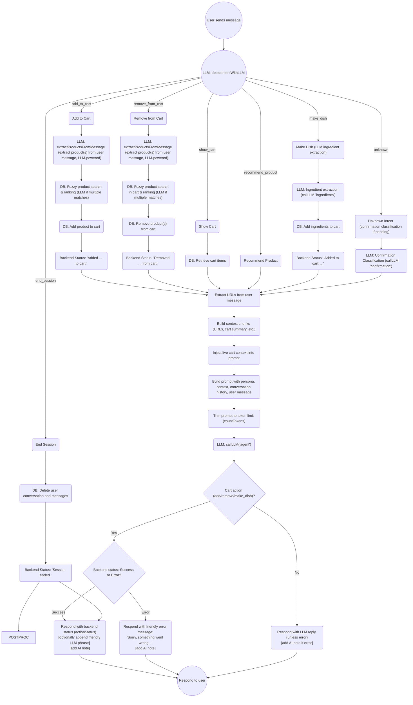

```mermaid
flowchart TD
    %% User and Intent Detection
    A(("User sends message")) --> B(("LLM: detectIntentWithLLM"))
    B -->|add_to_cart| C1("Add to Cart")
    B -->|remove_from_cart| C2("Remove from Cart")
    B -->|show_cart| C3("Show Cart")
    B -->|recommend_product| C4("Recommend Product")
    B -->|make_dish| C5("Make Dish (LLM ingredient extraction)")
    B -->|end_session| C6("End Session")
    B -->|unknown| C7("Unknown Intent (confirmation classification if pending)")

    %% Add to Cart branch
    C1 --> D1("LLM: extractProductsFromMessage (extract product(s) from user message, LLM-powered)")
    D1 --> E1("DB: Fuzzy product search & ranking (LLM if multiple matches)")
    E1 --> F1("DB: Add product to cart")
    F1 --> G1("Backend Status: 'Added ... to cart.'")
    G1 --> RAGa

    %% Remove from Cart branch
    C2 --> D2("LLM: extractProductsFromMessage (extract product(s) from user message, LLM-powered)")
    D2 --> E2("DB: Fuzzy product search in cart & ranking (LLM if multiple matches)")
    E2 --> F2("DB: Remove product(s) from cart")
    F2 --> G2("Backend Status: 'Removed ... from cart.'")
    G2 --> RAGa

    %% Show Cart branch
    C3 --> D3("DB: Retrieve cart items")
    D3 --> RAGa

    %% Recommend Product branch
    C4 --> RAGa

    %% Make Dish branch
    C5 --> D5("LLM: Ingredient extraction (callLLM 'ingredients')")
    D5 --> E5("DB: Add ingredients to cart")
    E5 --> F5("Backend Status: 'Added to cart: ...'")
    F5 --> RAGa

    %% Unknown branch
    C7 --> D7("LLM: Confirmation Classification (callLLM 'confirmation')")
    D7 --> RAGa

    %% End Session branch (direct to post-processing)
    C6 --> D6("DB: Delete user conversation and messages")
    D6 --> G6("Backend Status: 'Session ended.'")
    G6 --> POSTPROC

    %% RAG Pipeline steps (context & prompt building)
    RAGa("Extract URLs from user message") --> RAGb("Build context chunks (URLs, cart summary, etc.)")
    RAGb --> RAGc("Inject live cart context into prompt")
    RAGc --> RAGd("Build prompt with persona, context, conversation history, user message")
    RAGd --> RAGe("Trim prompt to token limit (countTokens)")
    RAGe --> AGENT("LLM: callLLM('agent')")

    %% Post-Processing Logic (NEW MVP robust rules)
    AGENT --> INTENTCHECK{"Cart action (add/remove/make_dish)?"}
    INTENTCHECK -- Yes --> STATUSCHECK{"Backend status: Success or Error?"}
    STATUSCHECK -- Success --> USESTATUS("Respond with backend status (actionStatus)\n[optionally append friendly LLM phrase]\n[add AI note]")
    STATUSCHECK -- Error --> ERRORMSG("Respond with friendly error message:\n'Sorry, something went wrong...'\n[add AI note]")
    INTENTCHECK -- No --> LLMRESP("Respond with LLM reply (unless error)\n[add AI note if error]")
    USESTATUS --> Z(("Respond to user"))
    ERRORMSG --> Z
    LLMRESP --> Z

    %% End session bypasses RAG/LLM and goes straight to post-processing
    G6 --> USESTATUS
```