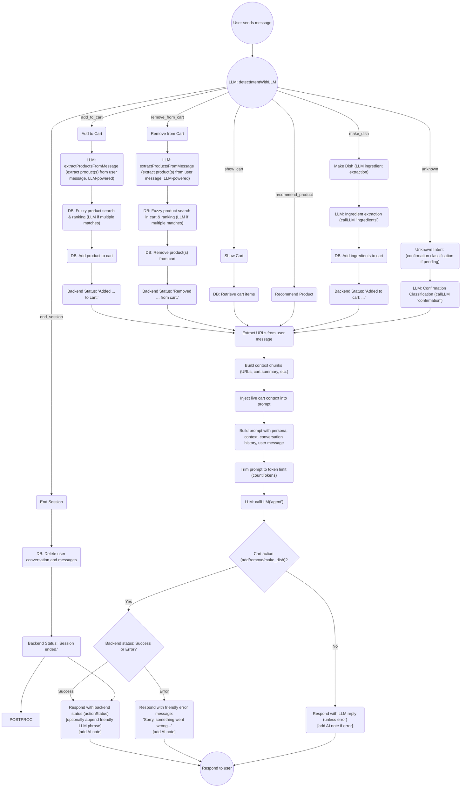

# System Diagrams & Coverage – Ecommerce AI Agent

## 1. Database Entity-Relationship Diagram (ERD)

---

## 2. API Coverage Matrix

| DB Table/Entity       | Related Endpoints                                  |
|-----------------------|----------------------------------------------------|
| USER                  | /api/users, /api/users/register, /api/users/oauth/google |
| CART                  | /api/carts, /api/cart-items                        |
| CART_ITEM             | /api/cart-items                                    |
| CATEGORY              | /api/categories                                    |
| PRODUCT               | /api/products, /api/search-index, /api/reviews     |
| ORDER                 | /api/orders, /api/order-items, /api/transactions   |
| ORDER_ITEM            | /api/order-items                                   |
| PAYMENT_METHOD        | /api/payment-methods                               |
| PAYMENT_METHOD_TYPE   | /api/payment-method-types                          |
| TRANSACTION           | /api/transactions                                  |
| REVIEW                | /api/reviews                                       |
| CONVERSATION          | /api/conversations                                 |
| MESSAGE               | /api/messages                                      |
| NOTIFICATION          | /api/notifications                                 |
| ROLE                  | /api/roles                                         |
| SEARCH_INDEX          | /api/search-index                                  |

---

## 3. Test Coverage Matrix

| Test File                | Endpoints Covered (CRUD)                        | Related Entities     |
|--------------------------|-------------------------------------------------|---------------------|
| carts.test.ts            | /api/carts (+cart-items)                        | CART, CART_ITEM     |
| categories.test.ts       | /api/categories                                 | CATEGORY            |
| orders.test.ts           | /api/orders                                     | ORDER, ORDER_ITEM   |
| products.test.ts         | /api/products                                   | PRODUCT             |
| order_items.test.ts      | /api/order-items                                | ORDER_ITEM, PRODUCT |
| users.test.ts            | /api/users, /api/users/register, /api/users/oauth/google | USER        |
| conversation_and_messages.test.ts | /api/conversations, /api/messages      | CONVERSATION, MESSAGE|
| notifications.test.ts    | /api/notifications                              | NOTIFICATION, USER  |
| payment_methods.test.ts  | /api/payment-methods, /api/payment-method-types | PAYMENT_METHOD, PAYMENT_METHOD_TYPE |
| roles.test.ts            | /api/roles                                      | ROLE                |
| transactions.test.ts     | /api/transactions                               | TRANSACTION, ORDER, USER, PAYMENT_METHOD |
| search_index.test.ts     | /api/search-index                               | SEARCH_INDEX, PRODUCT|
| reviews.test.ts          | /api/reviews                                    | REVIEW, PRODUCT, USER|

---

## 4. User Purchase Process Flow (Mermaid Flowchart)

---

## 5. Admin & Data Management Flow (Optional)

---

**Tip:** Use [Mermaid Live Editor](https://mermaid-js.github.io/mermaid-live-editor/) or a VSCode Mermaid extension to view and edit these diagrams.

If you want to add more flows (e.g., chatbot/LLM agent process, onboarding), just ask!

---

## 6. AI Agent Chatbot Workflow

